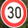

# **Traffic Sign Recognition**

---

**Build a Traffic Sign Recognition Project**

The goals / steps of this project are the following:
* Load the data set (see below for links to the project data set)
* Explore, summarize and visualize the data set
* Design, train and test a model architecture
* Use the model to make predictions on new images
* Analyze the softmax probabilities of the new images
* Summarize the results with a written report

[//]: # (Image References)

[image1]: ./examples/visualization.jpg "Visualization"
[image2]: ./examples/grayscale.jpg "Grayscaling"
[image3]: ./examples/random_noise.jpg "Random Noise"
[image4]: ./examples/placeholder.png "Traffic Sign 1"
[image5]: ./examples/placeholder.png "Traffic Sign 2"
[image6]: ./examples/placeholder.png "Traffic Sign 3"
[image7]: ./examples/placeholder.png "Traffic Sign 4"
[image8]: ./examples/placeholder.png "Traffic Sign 5"

## Rubric Points
### Here I will consider the [rubric points](https://review.udacity.com/#!/rubrics/481/view) individually and describe how I addressed each point in my implementation.  

---
### Writeup / README

#### 1. Provide a Writeup / README that includes all the rubric points and how you addressed each one. You can submit your writeup as markdown or pdf. You can use this template as a guide for writing the report. The submission includes the project code.

You're reading it! Check out [Traffic_Sign_Classifier.html](Traffic_Sign_Classifier.html) for an exported version of my notebook.

### Data Set Summary & Exploration  

#### 1. Provide a basic summary of the data set. In the code, the analysis should be done using python, numpy and/or pandas methods rather than hardcoding results manually.

I used basic numpy and did some exploratory analysis of the dataset:

- Number of training examples = 34799
- Number of testing examples = 12630
- Image data shape = (32, 32, 3)
- Number of classes (Labels) = 43

#### 2. Include an exploratory visualization of the dataset.

Primarily, I wanted to see the Label Distribution of the training data, as this was going to be an important factor for training, so I plotted a histogram of the labels (Class ID's).

The biggest take away from the histogram was that many of labels have very few examples.

Later on, I also plotted a random sign for visual inspection. Some of the signs are pretty distorted (for human eyes).

### Design and Test a Model Architecture

#### 1. Describe how you preprocessed the image data. What techniques were chosen and why did you choose these techniques? Consider including images showing the output of each preprocessing technique. Pre-processing refers to techniques such as converting to grayscale, normalization, etc. (OPTIONAL: As described in the "Stand Out Suggestions" part of the rubric, if you generated additional data for training, describe why you decided to generate additional data, how you generated the data, and provide example images of the additional data. Then describe the characteristics of the augmented training set like number of images in the set, number of images for each class, etc.)

As is common with CNN's, I normalized and grayscaled the images. Normalization helps the model train better by reducing the overall data range when we multiply weights, learning rates, etc. And since color is unlikely to be a useful feature, grayscaling helps reduce the overall amount of data, allowing faster training on large sets.

Here is a plot of a yield sign from above after grayscaling.

Lastly, I decided to add more training images. As I noted earlier in the label histogram, many of the labels have very few examples. This means the classifier never really learns them as it does not see them often enough and may also overfit for the other labels it does see a lot.

I first trained the model multiple times only on the given training images but could never beat a 93% validation rate. So I added about double the number of training images using a simple affine transformation on the under-represented labels, and was able to break the 93% validation rate.

#### 2. Describe what your final model architecture looks like including model type, layers, layer sizes, connectivity, etc.) Consider including a diagram and/or table describing the final model.

I used a basic LeNet architecture. I wanted to have experience with a well known model before moving on to other known architectures or creating my own.

LeNet is as follows:
  - Layer 1: Convolutional. Input = 32x32x1. Output = 28x28x6.
  - Activation (ReLu)
  - Pooling. Input = 28x28x6. Output = 14x14x6.
  - Layer 2: Convolutional. Output = 10x10x16.
  - Activation (ReLu)
  - Flatten. Input = 5x5x16. Output = 400.
  - Layer 3: Fully Connected. Input = 400. Output = 120.
  - Activation (ReLu)
  - Layer 4: Fully Connected. Input = 120. Output = 84.
  - Activation (ReLu)
  - Layer 5: Fully Connected. Input = 84. Output = 10.

#### 3. Describe how you trained your model. The discussion can include the type of optimizer, the batch size, number of epochs and any hyperparameters such as learning rate.

To train the model I mostly adjusted the epoch size. My learning rate was 0.001, which is pretty normal. I didn't touch the batch size as I didn't feel as comfortable understanding what changes it would make as I did adjusting EPOCH. I tried an epoch as high as 30 and was getting better results, likely because the model was seeing the under-represented classes more often, but my computer had trouble with that many epochs. I ended up with 20 epochs that got me to the 93% validation rate and that my computer was comfortable handling. Some day, I hope to be able to train more quickly on GPU's.

#### 4. Describe the approach taken for finding a solution and getting the validation set accuracy to be at least 0.93. Include in the discussion the results on the training, validation and test sets and where in the code these were calculated. Your approach may have been an iterative process, in which case, outline the steps you took to get to the final solution and why you chose those steps. Perhaps your solution involved an already well known implementation or architecture. In this case, discuss why you think the architecture is suitable for the current problem.

My final model results were:
* training set accuracy of 0.995
* validation set accuracy of 0.932
* test set accuracy of 0.910

I have explained a lot of my thinking in earlier answers. But to recap, I wanted to train with a basic LeNet architecture, as this model is easier to understand than others and from which I can build my learning. I was only able to reach a 93% validation accuracy after: 1) creating more test examples to compensate for the labels that were under-represented in the training data set & 2) increasing the number of epochs so the model could see the data more times (but that my computer could also handle).

It's clear I have a bit of overfitting on my training data. With a stronger computer, I would probable create more training data and adjust the hyperparameters more to see how that performed.

### Test a Model on New Images

#### 1. Choose five German traffic signs found on the web and provide them in the report. For each image, discuss what quality or qualities might be difficult to classify.

Here are six German traffic signs that I found on the web:

I like this set because there is a lot of similarity between the signs which will test how well the classifiers works on very similar images. Two signs are both triangles with an image inside the triangle. And the other four signs are all circular, with two sets looking very similar -- two with an up arrow and two with an outer red circle. The images are also bright, well cropped, with good contrast, and clearly denote what type of sign they are which definitely helps the model classify then better.

#### 2. Discuss the model's predictions on these new traffic signs and compare the results to predicting on the test set. At a minimum, discuss what the predictions were, the accuracy on these new predictions, and compare the accuracy to the accuracy on the test set (OPTIONAL: Discuss the results in more detail as described in the "Stand Out Suggestions" part of the rubric).

Fortunately, on this random image set, my model was 100% accurate. This is better than the 91% accuracy my model scored on the actual test set.

| Image			        |     Prediction	        					|
|:---------------------:|:---------------------------------------------:|
| Speed limit (30km/h)      		| Speed limit (30km/h)   									|
| Bumpy road     			| Bumpy road 										|
| Ahead only					| Ahead only											|
| No vehicles	      		| No vehicles					 				|
| Go straight or left			| Go straight or left      							|
| General caution			| General caution      							|

It seems my model may have learned these labels well, but this is a very small test. As stated above, the images are also bright, well cropped, with good contrast, and clearly denote what type of sign they are which definitely helps the model classify then better.

#### 3. Describe how certain the model is when predicting on each of the five new images by looking at the softmax probabilities for each prediction. Provide the top 5 softmax probabilities for each image along with the sign type of each probability. (OPTIONAL: as described in the "Stand Out Suggestions" part of the rubric, visualizations can also be provided such as bar charts)

My model happily predicted 5 of the 6 images at 100%. The sixth image it predicted at 63% was the 'General Caution' sign.

This sign is a red outer circle with an empty inner section, which looks A LOT like the other circular signs, so I can see why my model was less certain about this image.

| Certainty			        |     Prediction	        					|
|:---------------------:|:---------------------------------------------:|
| 100%      		| Speed limit (30km/h)   									|
| 100%     			| Bumpy road 										|
| 100%					| Ahead only											|
| 63%	      	| No vehicles					 				|
| 100%			    | Go straight or left      							|
| 100%		      | General caution      							|

### (Optional) Visualizing the Neural Network (See Step 4 of the Ipython notebook for more details)
#### 1. Discuss the visual output of your trained network's feature maps. What characteristics did the neural network use to make classifications?

(n/a, hope to come back to this later)
